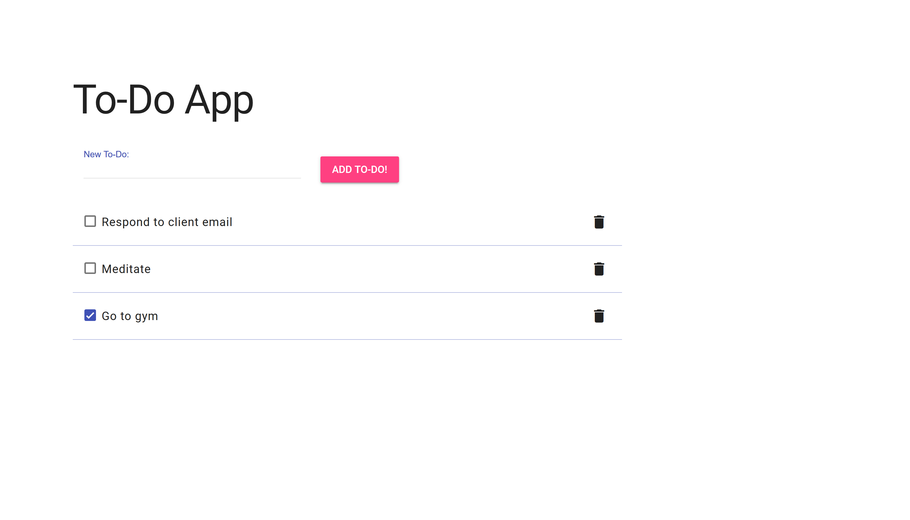

# to-do-app
A rudimentary, functional to-do app.

## Description
I built this to-do app to practice basic scripting and keeping state and UI separate in JavaScript. The styling incorporates Google's MDL design system.
